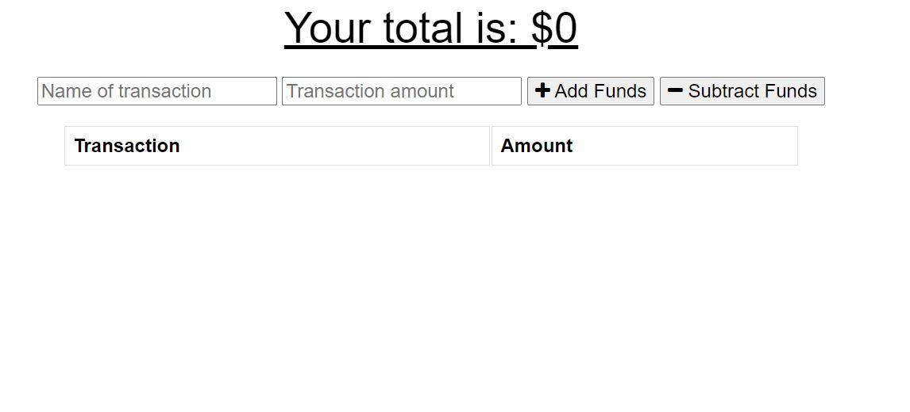
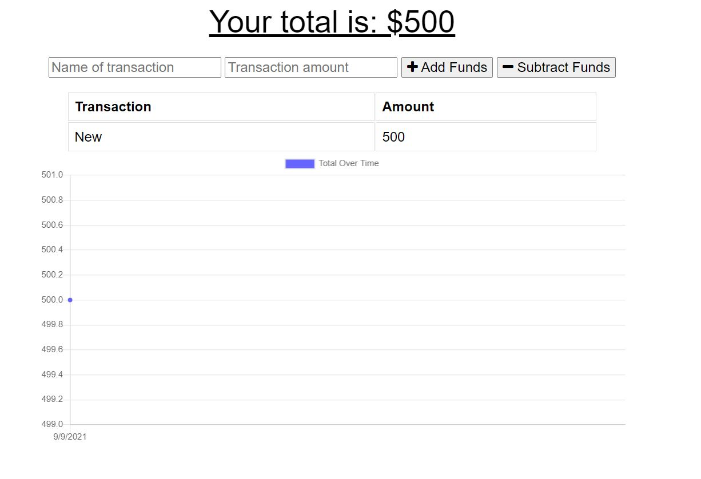

# budget-tracker

  ## Description
  This app provides you with a new way to keep tracket of your budget! Not only does this app records and calculates online transactions, it is also capable of recording your transactions offline so you wont have to worry about connection issues interrupting your transactions.

  ## Table of Contents
  * [Installation](#installation)
  * [Usage](#usage)
  * [Screenshots](#screenshots)
  * [License](#license)
  
  ## Installation
  To install, download as zip. You should have express.js, morgan, mongoose, and compression installed to run the application properly.

  ## Usage
  If you want to take record a transaction to keep track of your budget, you can simply title your transaction, enter an amount and either choose add or subtract from your budget. 

  ## Screenshots
  
  This is the Home Page of the Budget-Tracker app.

  
  Once a transaction is entered, it is recorded in a chart, as well as displayed in a graph to show you the timeline of you expenses.

  

  ## Contributing
  For further contributions, please contact me via email.

  ## Tests
  Tests were used by Insomnia to make sure routes were working properly.

  ## Questions
  If you have any questions or concerns about this application, please contact me via email: __bradleyj1@email.arizona.edu__ You may also visit my Github page: __https://github.com/JazmyneB__